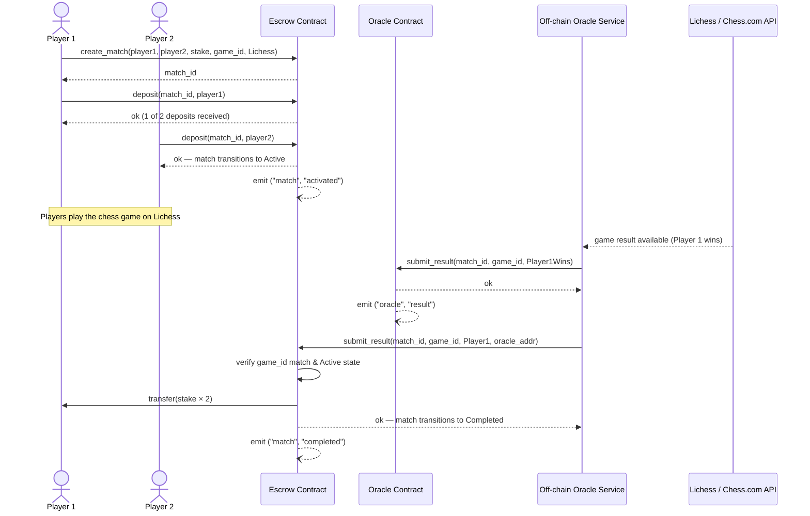
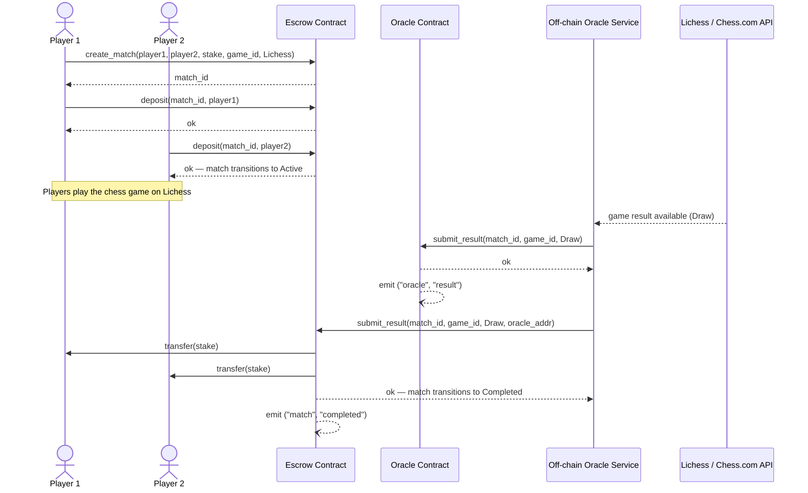

# Architecture Overview

## System Components

smile4money is composed of three Soroban smart contracts — **escrow**, **oracle**,
and **contract-registry** — and an off-chain oracle service. The
[contract-registry](#contract-registry) is a lightweight on-chain directory of
deployed contract addresses (see its dedicated section below).

```mermaid
flowchart TD
    P1[Player1]
    P2[Player2]
    FE[Frontend]
    EC[Escrow Contract<br/>Soroban]
    OC[Oracle Contract<br/>Soroban]
    CR[Contract Registry<br/>Soroban]
    OOS[Off-chain Oracle<br/>Service]
    LA[Lichess API]
    CA[Chess.com API]

    P1 -->|interacts| FE
    P2 -->|interacts| FE

    FE -->|create_match<br/>deposit<br/>cancel_match| EC

    OOS -->|GET /api/game/{id}| LA
    OOS -->|GET /pub/player/{user}/games| CA
    LA -->|game result| OOS
    CA -->|game result| OOS

    OOS -->|submit_result<br/>match_id, game_id, result| OC
    OOS -->|submit_result<br/>match_id, game_id, winner, caller| EC

    EC -->|payout<br/>stake_amount × 2| P1
    EC -->|payout<br/>stake_amount × 2| P2

    EC -.->|registered at deploy| CR
    OC -.->|registered at deploy| CR
    FE -.->|resolve live contract IDs| CR
```

## Match Lifecycle

```
create_match()
     │
     ▼
  Pending ──── deposit(player1) ──── deposit(player2) ──── Active
     │                                                        │
  cancel_match()                                    submit_result()
     │                                                        │
  Cancelled                                              Completed
```

State transitions are enforced on-chain. Deposits are rejected for any state other than `Pending`. Results are rejected for any state other than `Active`.

## Contract Storage

### Escrow Contract

| Key | Storage | Description |
|-----|---------|-------------|
| `DataKey::Oracle` | Instance | Trusted oracle address |
| `DataKey::Admin` | Instance | Admin address for pause/unpause |
| `DataKey::MatchCount` | Instance | Monotonic match ID counter |
| `DataKey::Paused` | Instance | Circuit-breaker flag |
| `DataKey::Match(id)` | Persistent | Full `Match` struct per match |

### Oracle Contract

| Key | Storage | Description |
|-----|---------|-------------|
| `DataKey::Admin` | Instance | Oracle service address |
| `DataKey::Result(id)` | Persistent | `ResultEntry` per match |

## Token Flow

All token transfers use the Stellar Asset Contract (SAC) interface via `soroban_sdk::token::Client`.

- On `deposit`: player → escrow contract address (`stake_amount`)
- On `submit_result` (win): escrow → winner (`stake_amount * 2`)
- On `submit_result` (draw): escrow → player1 (`stake_amount`), escrow → player2 (`stake_amount`)
- On `cancel_match`: escrow → each depositor (`stake_amount` each)

## Storage TTL

All persistent entries are written with a TTL of `518_400` ledgers (~30 days at 5 s/ledger). The TTL is refreshed on every state-changing write to prevent expiry during an active match.

## Sequence Diagrams

### Happy Path — Player 1 Wins

The diagram below shows the full flow from match creation through winner payout when Player 1
wins the game.



### Draw Path — Stakes Refunded

This diagram shows the flow when the game ends in a draw. Both players receive their original
stake back.



## Contract Registry

### Purpose

The `contract-registry` contract (`contracts/contract-registry`) provides a lightweight
on-chain directory of deployed contract addresses. Deployment scripts register the escrow and
oracle contract IDs here after each deploy; the frontend and any tooling can query the registry
instead of reading contract IDs from environment variables or configuration files. This
eliminates the need to redistribute `.env` files when contracts are redeployed.

The registry also stores a capped log of deployment events via `submit_event`, giving a
lightweight on-chain audit trail of when contracts were registered or updated.

### Deployment relationship

```
deploy_testnet.sh / deploy_mainnet.sh
        │
        ├─► deploy escrow.wasm       ──► CONTRACT_ESCROW
        ├─► deploy oracle.wasm       ──► CONTRACT_ORACLE
        ├─► deploy contract-registry ──► CONTRACT_REGISTRY
        │
        ├─► registry.register_contract(admin, "escrow")
        ├─► registry.submit_event(admin, "escrow_deployed")
        ├─► registry.register_contract(admin, "oracle")
        └─► registry.submit_event(admin, "oracle_deployed")
```

On redeployment the script calls `deregister_contract` before `register_contract` so the
registry always reflects the currently live contract IDs.

### Contract Registry API

```
initialize(admin: Address, max_events: u32) -> Result<(), Error>
register_contract(caller: Address, contract_id: Symbol) -> Result<(), Error>
update_contract(caller: Address, contract_id: Symbol) -> Result<(), Error>
deregister_contract(caller: Address, contract_id: Symbol) -> Result<(), Error>
registration_count() -> u32
get_registration(contract_id: Symbol) -> Result<ContractRecord, Error>
submit_event(caller: Address, event_name: Symbol) -> Result<(), Error>
pause(caller: Address) -> Result<(), Error>
unpause(caller: Address) -> Result<(), Error>
```

`register_contract`, `update_contract`, and `pause`/`unpause` are restricted to the **admin**
address set at initialisation.

`deregister_contract` may be called by either the admin or the original registrant.

`submit_event` is open to any authenticated caller but is capped by `max_events`; once the
cap is reached every further call returns `Error::MaxEventsReached`.

### Errors

| Error | Code | Meaning |
|-------|------|---------|
| `Unauthorized` | 1 | Caller is not the admin (or registrant for `deregister_contract`) |
| `ContractPaused` | 2 | Registry is paused; mutating operations are blocked |
| `MaxEventsReached` | 3 | The event log has hit the cap set at initialisation |
| `ContractNotFound` | 4 | No registration exists for the given `contract_id` symbol |
| `AlreadyRegistered` | 5 | A registration with this `contract_id` symbol already exists |

### Storage

| Key | Storage | Description |
|-----|---------|-------------|
| `DataKey::Admin` | Instance | Admin address |
| `DataKey::Paused` | Instance | Circuit-breaker flag |
| `DataKey::MaxEvents` | Instance | Maximum event log capacity |
| `DataKey::RegistrationCount` | Instance | `u32` counter of live registrations, used to bound pagination loops |
| `DataKey::Registration(Symbol)` | Persistent | One `ContractRecord` per registered contract, keyed by its `Symbol` |
| `DataKey::Events` | Instance | `Vec<Symbol>` — ordered event log |

`ContractRecord` fields: `registrant: Address`, `contract_id: Symbol`, `active: bool`.

Each registration lives in its own persistent storage entry (`DataKey::Registration(Symbol)`),
mirroring how the escrow contract stores match records. Reads and writes touch only the entry
for the affected contract instead of deserializing the whole registry, and growth no longer
risks exceeding Stellar's per-entry storage size limit. `registration_count()` returns the
number of live registrations so off-chain pagination can iterate `get_registration` calls
without scanning a monolithic map.

### Frontend usage

The frontend reads the registry at startup to resolve current contract IDs:

```ts
const escrowId  = await registry.getRegistration("escrow");
const oracleId  = await registry.getRegistration("oracle");
```

This means the frontend configuration does not need to be rebuilt or redeployed when contracts
are upgraded — only the registry entry needs to be updated by the admin.

## Events

| Contract | Topics | Data |
|----------|--------|------|
| Escrow | `("match", "created")` | `(match_id, player1, player2, stake_amount, game_id)` |
| Escrow | `("match", "activated")` | `match_id` |
| Escrow | `("match", "deposit")` | `(match_id, player, stake_amount)` |
| Escrow | `("match", "completed")` | `(match_id, winner, payout_amount)` |
| Escrow | `("match", "cancelled")` | `(match_id, caller)` |
| Escrow | `("admin", "paused")` | `()` |
| Escrow | `("admin", "unpaused")` | `()` |
| Escrow | `("admin", "oracle")` | `new_oracle` |
| Escrow | `("admin", "adm_xfer")` | `(old_admin, new_admin)` |
| Oracle | `("oracle", "init")` | `admin` |
| Oracle | `("oracle", "result")` | `(match_id, result, timestamp)` |
| Oracle | `("oracle", "adm_xfer")` | `(old_admin, new_admin)` |
